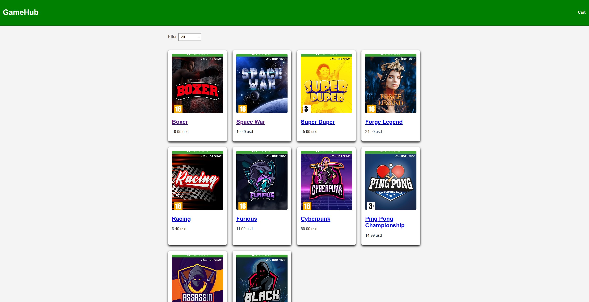

# GameHub

GameHub is a functional e-commerce website for video games. The project uses JavaScript to fetch products from an API and allows users to view products, add the to the cart and complete a checkout flow.

## Description
This project was created for my JavaScript 1 course assignment. The goal was to build a dynamic online store using HTML, CSS and JavaScript. The project includes API integration, product details, cart functionality and checkout logic.

Features
- Fetches products from an API
- Product listing page
- Product detail page
- Add to cart functionality
- Quantity management in cart
- Remove products from cart
- Checkout page
- Confirmation page
- Product images in cart

## Built with
- HTML
- CSS
- JavaScript
- Noroff API

## Live site
https://remiytter.github.io/CA-javascript/

## Contact
[LinkedIn](https://www.linkedin.com/in/remi-ytterdahl/?locale=en)

remiytter@hotmail.com

## Author
Remi Ytterdahl
